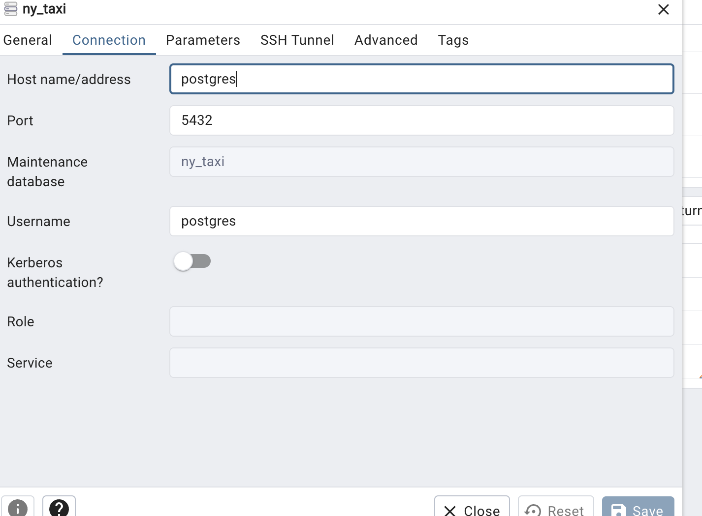

# Question 1. Understanding docker first run

To run

`docker run -it python:3.12.8 /bin/bash` will open a bash shell in the container.
Now we can find the pip version by running:
`pip --version`

Answer:

`pip 24.3.1`

# Question 2. Understanding Docker networking and docker-compose

For this question, we run `docker compose -f 'week_1/compose.yml' up -d --build`

Now we see containers are started for postgres and pgadmin.

We see in pgadmin that we can connect to the database by using `postgres:5432`



# Question 3. Trip Segmentation Count

During the period of October 1st 2019 (inclusive) and November 1st 2019 (exclusive), how many trips, respectively, happened:

Up to 1 mile: 
In between 1 (exclusive) and 3 miles (inclusive),
In between 3 (exclusive) and 7 miles (inclusive),
In between 7 (exclusive) and 10 miles (inclusive),
Over 10 miles

Query: 
```sql
select 
sum(case when trip_distance<=1 then 1 else 0 end) as trips_under_1_mile,
sum(case when trip_distance > 1 and trip_distance <=3 then 1 else 0 end) as trips_between_1_and_3_miles,
sum(case when trip_distance > 3 and trip_distance <=7 then 1 else 0 end) as trips_between_3_and_7_miles,
sum(case when trip_distance > 7 and trip_distance <=10 then 1 else 0 end) as trips_between_7_and_10_miles,
sum(case when trip_distance>10 then 1 else 0 end) as trips_over_10_mile
from green_taxi_Data
where lpep_dropoff_datetime >=timestamp '2019-10-01 00:00:00' 
AND lpep_dropoff_datetime< timestamp '2019-11-01 00:00:00'
```

Result:


104802	198924	109603	27678	35189

