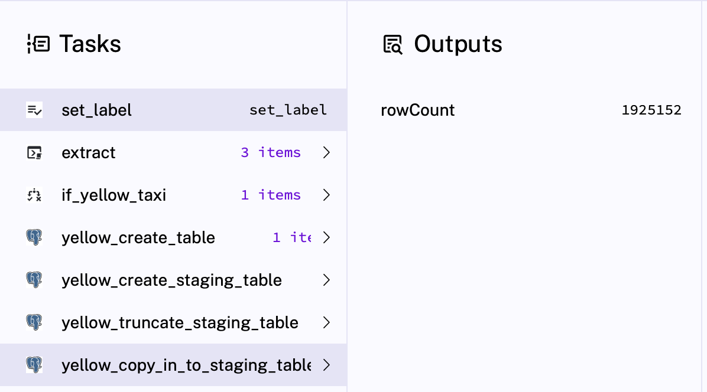
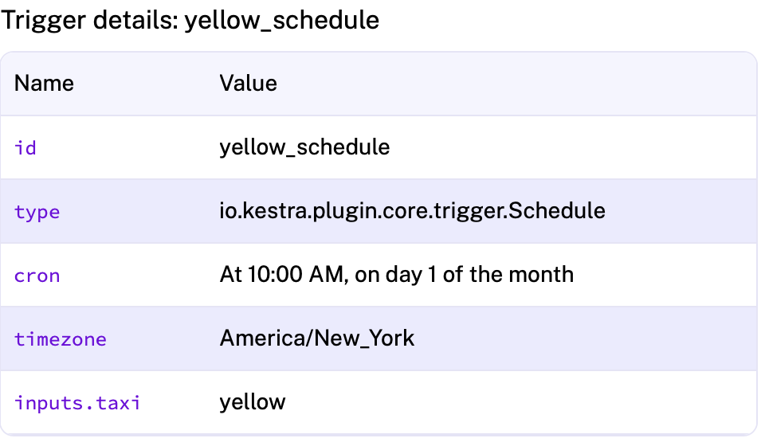

### Setup for this week

- I am running from a vscode [devcontainer](../.devcontainer/devcontainer.json) with [docker image](../Dockerfile)
- [Docker compose file](../compose.yml) was updated to include Kestra.
- Kestra flows used can be found in [this folder](../flows/)


### Quiz Questions

Complete the Quiz shown below. It’s a set of 6 multiple-choice questions to test your understanding of workflow orchestration, Kestra and ETL pipelines for data lakes and warehouses.

1) Within the execution for `Yellow` Taxi data for the year `2020` and month `12`: what is the uncompressed file size (i.e. the output file `yellow_tripdata_2020-12.csv` of the `extract` task)?
- [x] 128.3 MB
- [] 134.5 MB
- [] 364.7 MB
- [] 692.6 MB

2) What is the rendered value of the variable `file` when the inputs `taxi` is set to `green`, `year` is set to `2020`, and `month` is set to `04` during execution?
- [] `{{inputs.taxi}}_tripdata_{{inputs.year}}-{{inputs.month}}.csv` 
- [x] `green_tripdata_2020-04.csv`
- [] `green_tripdata_04_2020.csv`
- [] `green_tripdata_2020.csv` 

3) How many rows are there for the `Yellow` Taxi data for all CSV files in the year 2020?

We run a backfill for the full 2020 year. Then we check the resulting table count. We add a where clause so this also works after we load other years/months

```sql
select count(*) 
from yellow_tripdata_scheduled
where filename like 'yellow_tripdata_2020%'
```

- [] 13,537.299
- [x] 24,648,499
- [] 18,324,219
- [] 29,430,127

4) How many rows are there for the `Green` Taxi data for all CSV files in the year 2020?

We run a backfill for the full 2020 year. Then we check the resulting table count. We add a where clause so this also works after we load other years/months.

```sql
select count(*) 
from green_tripdata_scheduled
where filename like 'green_tripdata_2020%'
```

- [] 5,327,301
- [] 936,199
- [x] 1,734,051
- [] 1,342,034

5) How many rows are there for the `Yellow` Taxi data for the March 2021 CSV file?

We choose a backfill for march 2021. Then we check table data for march 2021.


```sql
select count(*) 
from yellow_tripdata_scheduled
where filename = 'yellow_tripdata_2021-03.csv'
```


We can also see this in kestra itself in the `copy to staging` step 


- [] 1,428,092
- [] 706,911
- [x] 1,925,152
- [] 2,561,031


6) How would you configure the timezone to New York in a Schedule trigger?

In the kestra help, we can find how to configure this, when changing the yaml as follows:

```
  - id: yellow_schedule
    type: io.kestra.plugin.core.trigger.Schedule
    cron: "0 10 1 * *"
    timezone: America/New_York
    inputs:
      taxi: yellow
```

We indeed see in the kestra UI that the timezone of the schedule has changed: 


- [] Add a `timezone` property set to `EST` in the `Schedule` trigger configuration  
- [x] Add a `timezone` property set to `America/New_York` in the `Schedule` trigger configuration
- [] Add a `timezone` property set to `UTC-5` in the `Schedule` trigger configuration
- [] Add a `location` property set to `New_York` in the `Schedule` trigger configuration  


## Submitting the solutions

* Form for submitting: https://courses.datatalks.club/de-zoomcamp-2025/homework/hw2
* Check the link above to see the due date