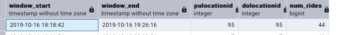

# Homework

In this homework, we're going to learn about streaming with PyFlink.

Instead of Kafka, we will use Red Panda, which is a drop-in
replacement for Kafka. It implements the same interface, 
so we can use the Kafka library for Python for communicating
with it, as well as use the Kafka connector in PyFlink.

For this homework we will be using the Taxi data:
- Green 2019-10 data from [here](https://github.com/DataTalksClub/nyc-tlc-data/releases/download/green/green_tripdata_2019-10.csv.gz)


## Setup

We used following services:

- Red Panda
- Flink Job Manager
- Flink Task Manager
- Postgres
- PgAdmin

We used the following docker compose [file](docker-compose.yml) to start the services and 
a virtual environment for development. 


## Question 1: Redpanda version

Now let's find out the version of redpandas. 

For that, check the output of the command `rpk help` _inside the container_. The name of the container is `redpanda-1`.

Find out what you need to execute based on the `help` output.

What's the version, based on the output of the command you executed? (copy the entire version)

Via docker desktop we open a terminal in the container and execute:

```
rpk version
```

The output is:

```
Version:     v24.2.18
Git ref:     f9a22d4430
Build date:  2025-02-14T12:59:41Z
OS/Arch:     linux/arm64
Go version:  go1.23.1

Redpanda Cluster
  node-1  v24.2.18 - f9a22d443087b824803638623d6b7492ec8221f9
```


## Question 2. Creating a topic

Before we can send data to the redpanda server, we
need to create a topic. We do it also with the `rpk`
command we used previously for figuring out the version of 
redpandas.

Read the output of `help` and based on it, create a topic with name `green-trips` 

What's the output of the command for creating a topic? Include the entire output in your answer.
We create a topic by the following command:

`rpk topic create green-trips`

Output:

```
TOPIC        STATUS
green-trips  OK
```

## Question 3. Connecting to the Kafka server

We need to make sure we can connect to the server, so
later we can send some data to its topics

First, let's install the kafka connector (up to you if you
want to have a separate virtual environment for that)

```bash
pip install kafka-python
```

You can start a jupyter notebook in your solution folder or
create a script

Let's try to connect to our server:

```python
import json

from kafka import KafkaProducer

def json_serializer(data):
    return json.dumps(data).encode('utf-8')

server = 'localhost:9092'

producer = KafkaProducer(
    bootstrap_servers=[server],
    value_serializer=json_serializer
)

producer.bootstrap_connected()
```

Provided that you can connect to the server, what's the output
of the last command?

`True`

## Question 4: Sending the Trip Data

Now we need to send the data to the `green-trips` topic.

The code is in [notebook](flink.ipynb)


How much time did it take to send the entire dataset and flush? 

`36.41 s`


## Question 5: Build a Sessionization Window (2 points)

Now we have the data in the Kafka stream. It's time to process it.

* Copy `aggregation_job.py` and rename it to `session_job.py`
* Have it read from `green-trips` fixing the schema
* Use a [session window](https://nightlies.apache.org/flink/flink-docs-master/docs/dev/datastream/operators/windows/) with a gap of 5 minutes
* Use `lpep_dropoff_datetime` time as your watermark with a 5 second tolerance
* Which pickup and drop off locations have the longest unbroken streak of taxi trips?

First, we create two tables in postgres through pgadmin:

- A sink for the raw rides for debugging
```sql
CREATE TABLE IF NOT EXISTS taxi_rides_green_flink
(
lpep_pickup_datetime VARCHAR,
lpep_dropoff_datetime VARCHAR,
PULocationID INTEGER,
DOLocationID INTEGER,
passenger_count INTEGER,
trip_distance FLOAT,
tip_amount FLOAT
)
```
- A sink for the aggregated window rides:

```sql
CREATE TABLE IF NOT EXISTS rides_aggregated
(
window_start TIMESTAMP,
window_end TIMESTAMP,
pulocationid INTEGER,
dolocationid INTEGER,
num_rides BIGINT
)
```

We used the following pyflink code: [session_job](./src/job/session_job.py) and submit this to flink via

```
docker compose exec jobmanager ./bin/flink run -py /opt/src/job/session_job.py --pyFiles /opt/src
```
Now we can find the output in our database:



PULocationID and DOLocationID 95 has the longest streaks of trips with a gap less than 5 mins (44).

## Submitting the solutions

- Form for submitting: https://courses.datatalks.club/de-zoomcamp-2025/homework/hw6
- Deadline: See the website
